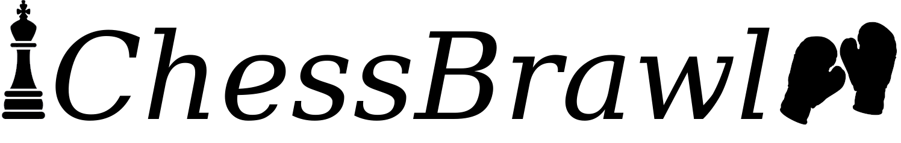
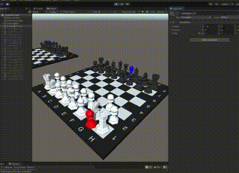

Chess for the Sophisticated.

# Result board

https://docs.google.com/spreadsheets/d/1vLPF9WEUuqI6n34Wo41OAbFHOeJACiuNkI61odF_tic/edit

# Trainble Values

| Name  | Description | User interaction equivalent |
| ------------- | ------------- | ------------- |
| x-axis  | for agent movement  | arrow key |
| y-axis  | for agent movement  | arrow key |
| speed | for agent movement  | none |
| kickforce |  applied to kicked objects  | none |

# Reward parameters

| Name  | Description | Idea/Learning |
| ------------- | ------------- | ------------- |
| Collision Penalty Wall | (Rule) Large penalty for throwing the agent off the board (the wall is the boundary) | Obvious rule to prevent the agent from falling |
| CP Touching Other Agent  | (Rule) Large penalty for touching  | Rule of the game |
| CP Touching opponent piece | (Rule) Large penalty; Agents should not touch opposing pieces | Rule of the game |
| CP Kicking of own piece |  Apply penalty for doing an action that kicks of a piece of your own  | Disincentivise the agents from losing pieces through own actions  |
| Collision Reward Touching own piece | Reward for touching one of your own chess pieces  | Intended to incentivise movement and interaction of the agent |
| CR Kick Motion (Chain reation)  | Calculates an extra reward for a kick that leads to a sucessful kick off of an oponent piece | Incentivise actions that directly lead to kicking of oponent pieces |
| CR Kicking Off Oponent Piece (Globally) | Reward for a oponent piece falling off the board | intended as a global reward similar to the human score for removing pieces from the board |

# Rules of the game

Somewhat different from rewards.
* Don't touch other player or it's pieces (Game Over/Reset)
* Don't fall off the board (Game Over/Reset)
* Get points if opponent pieces fall off the board, loose points if your pieces fall of the board

# How to play game in human play mode
* How to move agents forward: Key W
* How to move agents backward: Key S
* How to rotate agents from right to left: Key A
* How to rotate agents from left to right: Key D
* How to move agents from left to right: Key Q
* How to move agents from right to left: Key E
  

# Ideas to try

* Additional physical boundaries, some wall in the middel or to the sides
* Make agent King or Queen instead of external pawn
* How to control speed and kickforce as human?
* Introduce timelimit for training (in epoch steps) and interactive game (as time?)
* Third person camera (already implemented)
* Score board for humans (already implemented)

# DEMO video on Friday as part of presentation:

120 seconds
16:9 MP4

# Afterwards
Project abstract, which kind of training etc, user interactions etc
Statment of contribution of each project member

# Progress log
Monday:
* Initial version by Ludwig tested on monday
* Problems with running the training on some laptops (either too weak, or cuda not installed)
* Defining rewards in a single file
* User centric features like scoreboard and speed control
* Table for documentation of parameters and trained models for comparison

Tuesday:
* use ml-agents Ray Perception as a different observation mode to fix learning problems
* reimplement some most functionality for Ray Perception 
* add bouncing side walls
* fix CUDA install on laptop to increase learning speed

Wednesday:
* Fix the falling off with layers
* Fix counting pieces (OnCollisionEnter, OnCollisionExit, sometimes not triggered) (Mean distancefunction does wierd stuff)
* Fix Rayvision tags with huge success
* Reimplement Gamemanager

Thursday:
* Change gamemode: New goal should be most points after clearing the board
* Collect videos
* Broken ELO system 

# Contributions

| Task  | Contributors |
| ------------- | ------------- |
| Concept | Ludwig, Max, Van, Martin |
| Game specification | Ludwig, Max, Martin  |
| Reward function setup | Ludwig, Max, Martin |
| Unity development | Ludwig, Martin |
| User-Testing | Van |
| ML-Model-Training | Ludwig, Van |
| ML-Model-Evaluation | Ludwig, Max, Van, Martin |

# Human score calculation

| Action  | Score |
| ------------- | ------------- |
| Touch opponent piece | -600 |
| Opponent piece falls off | +500 |
